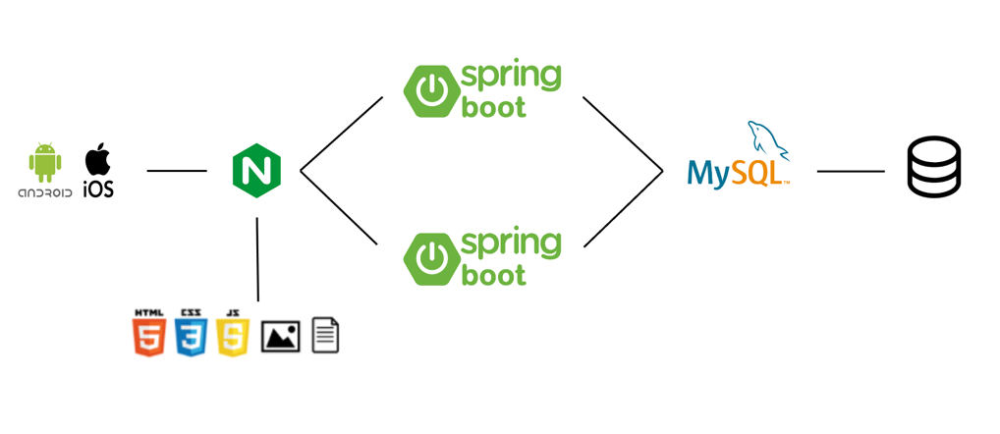
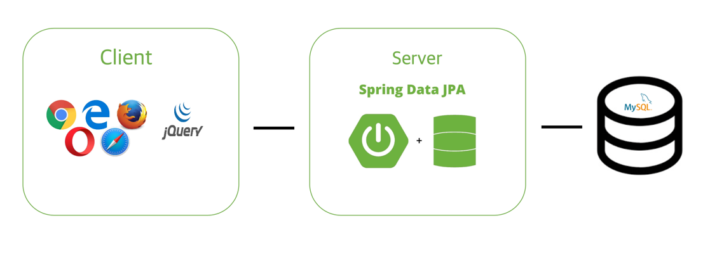

#개발일지
# 7월 27일 개발 일지

1. ResponseEntity로 반환하도록 수정했다. -> *상태코드!!!!* 
회사에서 KEP API 개발 프로젝트를 진행하면서 상태코드의 중요성을 새삼 꺠달았다. 상태코드는 상대방(타 서버, 혹은 클라이언트)과의 대화라고 할 수 있다. 대화가 없으면 엄청 답답할 것이다 :) 
2. 옷장 관련 이미지 1개 업로드 기능 구현했다. 
-> 파일 명은 보통 어떻게 처리할까? 
-> 나는 중복을 피하기 위해 UUID 랜덤 + 유저 이메일 + 파일명으로 처리하였음. 
3. Try catch가 미치도록 반복돼서 방법을 찾아봤다. 
-> Spring이 제공하는 ExceptionHandler에 대해 공부해보자.
 [Spring컨트롤러 예외처리를 자동으로](https://velog.io/@aidenshin/Spring-Boot-Exception-Controller)

# 8월 2일 개발 일지 
1. ControllerAdvice와 ExceptionHandler를 이용하여 Try catch를 아예 없애버렸다.
2. 코드가 엄청 깔끔해졌다! 
3. 그렇다면 Exception을 이상적으로 처리하는 방법은 무엇이 있을까? 
4. 한번 알아보자! 일단은 ResponseEntity를 반환하여 상황에 맞는 상태코드와 메시지를 반환하는 방식으로 진행하였다 :)

*RuntimeException이 뭐지?*
-> *UnCheckedException*이다. 꼭 처리해주지 않아도 된다. 
-> 반대로 *CheckedException*은 try catch로 처리하든가, 혹은 상위 메서드로 꼭 throw를 해야한다. 대표적으로 IOException이 있다.


# 8월 4일 개발 일지 
1. 검색 기능을 개발하려고 한다. 
2. 일단은 Like 쿼리를 이용해서 구하려고 하는데 이게 최선일까? 
3. 일단 엘라스틱 서치 강의를 등록했다 :) 
4. Like 쿼리로 구현해놓고, 엘라스틱 서치 강의를 완강한 후에 생각해보자! 


# 2021년 8월 8일 개발 일지 
1. 옷 이미지 저장 기능을 다 구현했다. 
-> 이미지로 제한하기 구현이 필요하다. 
-> 이미지 등록시에 이미지 미리보기 기능이 필요하다. (FE) 

2. 좋아요 누르면 200이 리턴되는데 parsor error라고 하면서 오류로 분류된다. 
-> dataType : 서버에게 요청하는 반환 타입인데, json으로 설정해놓고 컨트롤러에서는 Null을 반환하고 있었다. 혹은 그냥 Long type 
text로 변경하니까 된다. 


# 2021년 8월 16일 개발일지 

DTO에 _message, _code 필수적으로 포함하도록 수정   
```java
@Data
public class ReponseForWardrobes {
    private Integer _code = 200;
    private String _message = “OK”;
    private List<ContentForWardrobe> contents;
}
```

```json
{
    "_code": 200,
    "_message": "OK",
    "contents": [
        {
            "id": 1,
            "name": "TEST",
            "clothesCnt": 0,
            "likeCnt": 0,
            "memberName": "토리"
        }
    ]
}

```


DTO 이름 수정 
```text
ResponseForXXX
RequestForXX 
```

 
# 2021년 8월 21일 개발 일지 
1. 여러 곳곳에서 또 status code : 200, parsor error 뿜어내기 시작했다. 데이터는 정상적으로 저장, 가져오지만 Redirect가 안된다. 
-> 이전과 같이 단순히 text로 응답하지만 dataType : json으로 보내기 때문임! 
-> API 를 구현 중이니까, 모두 JSON으로 응답할 수 있도록 수정 (Resposne 클래스 추가) 

2. 모든 컨트롤러의 메서드가 JSON으로 응답하기 때문에, 공통적으로 사용할 `Response` 클래스가 필요함. 개발 완료 
```java
class Repsonse {
	int _status;
	String _message; 
}
```

-> 공통으로 사용되는 `Response`가 생겼으니, 모든 응답 DTO는 `Response`를 상속받아 상태코드와 메시지 필드를 포함하도록 수정

3. 쓸데없는 Exception을 이용한 분기 처리는 제외하고 모두 if문으로 분기할 수 있도록 수정. Exception으로 처리하다 보니 코드가 이해가 안되는 경우가 많았음 

4. `Controller`에서는 무조건 DTO를 활용하여 응답하도록 수정, `Entity` 자체를 이용하여 응답하는 것은 API 설계를 `Entity`에 의존적으로 만들어버리기 때문에 옳지 않다고 생각 

5. Null을 사용해야 하는 부분은 Optional을 사용하지 않도록 수정. Optional은 Null이 없도록 하는 메커니즘인데 굳이 null을 반환시키는 것은 적합하지 않다고 생각하여서 수정 


# 2021년 8월 23일 개발 일지
회사 동기와 신규 프로젝트를 시작했다. 
이번 프로젝트는 좀 제대로 해보고 싶어서 여러가지를 시도 해보려고 한다.

우선 기획서를 작성했다. 
이 프로젝트를 왜 시작했는지, 또 어떤 기능을 포함하고 어떤 제약 조건을 가지고 있는지 문서로 작성하여 pdf로 저장했다. 

그 다음으로 개발, 운영 서버로 나눠보고 싶었다.
`application-dev.properties`
`application-prod.properties`로 나눠봤다.

그렇다면 실행은 어떻게 해야하지? 그냥 실행하면 설정파일을 못찾아서 오류가 터진다.
따로 직접 설정을 해줘야 한다.

일단 인텔리제이에서 실행하는 경우 

1. edit configuration 검색해서 아래 옵션창에 접속한다.

[image:B2B795F1-9D4F-44C5-8EC5-20013B1B7297-1266-00046D3B056CA80C/6FBFA369-F349-43F2-A662-FBC32A78F6EA.png]

2. Active profiles를 원하는 것으로 설정한다 (`dev`, `prod`) 
3. 실행하면 dev를 기준으로 실행되는 것을 확인할 수 있다.

# 2021년 8월 26일 개발 일지 
우여 곡절이 많았다. 동기가 clone 받아서 실행을 하면, 인텔리제이 자체에서 SQL 드라이버를 인식을 못하는 문제가 발생했다. 이걸로 3일 정도 많은 시도를 해본 것 같다. 

1. 드라이버 재 설치
2. Grade reload 
3. 프로젝트 다시 만들기 

결론은 인텔리제이 커뮤니티 버전은 SQL을 지원을 안하는 것을 확인했다. 커뮤니티 버전은 JVM 개발자만 사용이 가능할정도로 굉장히 제약조건이 많다. 
WAS 개발을 위해서는 얼티메이트가 필수인 것을 확인하였고 결국 문제를 해결할 수 있었다. 

추가적으로 기획서를 작성하였다. 이번주 주말까지 각자 기능을 맡아서 흐름도를 작성해오기로 했다. 

# 2021년 8월 28일 개발 일지 
오늘은 개인 프로젝트인 나만의 옷장 통계 기능을 개발했다. 
단순히 브랜드, 색상, 구매 방법, 종류에 따라서 탑 5을 보여주는 기능이다. 
로직을 설명하자면 

1. HashMap을 이용하여 각 항목별 갯수를 카운트한다. 
2. 갯수를 기준으로 HashMap의 KeySet을 정렬한다. 
3. KeySet의 탑 5 혹은 그 이하만큼 Response 객체에 담는다. 
4. 반환한다. 

```json
{
    "content": [
        {
            "name": "발렌시아가",
            "type": "Brand",
            "percent": 100,
            "count": 1
        },
        {
            "name": "블루",
            "type": "Color",
            "percent": 100,
            "count": 1
        },
        {
            "name": "무신사 스토어",
            "type": "BuyingType",
            "percent": 100,
            "count": 1
        },
        {
            "name": "신발",
            "type": "Type",
            "percent": 100,
            "count": 1
        }
    ]
}

```

구현을 다 한 후에 실행해봤는데 8080 포트를 이미 사용중이라는 오류가 발생한다. 아마 동기와 함께 하는 프로젝트 WAS가 포트를 잡고 있는 것 같다.

```
lost -I 8080 // 8080 포트를 사용하고 있는 어플리케이션 PID 학인 
kill -9 (pid) // pid 프로세스 킬 
```

위와 같이 프로세스를 죽이고 수행하니 정상 작동한다. 

*No converter found for return value of type : class xxx.*

오류가 발생하기 시작했다. 공통점은 `Response` 클래스를 `ResponseEntity`에 포함시켜 응답하는 경우 로직은 정상 동작하지만 ajax 응답 메시지로 오류메시지가 반환되는 것을 확인했다.  

대충 해석하자면 `Response` 클래스를 JSON으로 Convert 하지 못했다는 문제인 것 같은데… 왜이럴까? 

열시미 구글링을 해봤는데 `@Getter` 가 없어서 발생하는 것 같다하여, 수정해보니 역시나 정상 동작한다. 

**`@Getter`랑 무슨 상관일까?**
```text
Java는 프로퍼티를 제공하는 문법이 없습니다. ( 멤버변수랑은 다릅니다. )
Java의 프로퍼티는 보통 Getter 와 Setter의 이름 명명 규칙으로 정해집니다.
문법적으로 정해지는것이 아니다 보니, 개발자가 일일이 신경써줘야 하는게 자바의 단점 중 하나입니다.
Person 같은 경우는 Getter만 존재 하므로, Getter를 기준으로 프로퍼티를 도출 할 수 있습니다. 즉 Name 과 Job이 Person 프로퍼티입니다. 
Person의 멤버변수 이름도 똑같이 name, job이지만, 
앞서 설명했드시 프로퍼티는 Getter, Setter기준이므로 멤버변수 이름을 변경하더라도 상관 없습니다. 
갑자기 프로퍼티를 설명한 이유는 많은 라이브러리가 해당 프로퍼티 개념으로 작동하기 때문입니다.
Jackson라이브러리도 마찬가지 입니다. JSON데이터로 출력되기 위해서는 멤버변수의 유무가 아닌 프로퍼티 즉, Getter, Setter를 기준으로 작동합니다.
```

Jackson 라이브러리가 정상 동작하기 위해서는 프로퍼티가 존재해야 하는데, 자바에서는 Getter와 Setter 기준으로 프로퍼티를 도출한다고 한다. 
따라서 적어도 Getter는 필수이다 :) 

# 2021년 9월 2일 개발 일지
오늘은 전체 통계 기능 외에 유저 한명을 위한 통계 기능 개발을 진행 했다. 
개발 중에 의문을 가지게 되었다. 

일단 통계를 내는 메인 로직은 동일한 로직을 사용하기 때문에 조건에 따라서 전체 통계를 내든, 유저 한명을 위한 통계를 내든 해야 한다.

처음에는 이렇게 했다.

```java
if(member == null) {
	// 전체 통계 
}
else {
	// 유저 통계
}
``` 

그런데 이렇게 하게 되면 컨트롤러에서 null을 인자로 넣어줘야 한다. 물론 기능은 정상 동작했다. 근데 이게 맞는 걸까? 

```java
return StatisticsService.getStatistics(null); 
```

한번 인터넷에 검색해봤다. 역시나 클린 코드에 위배 되는 행동 이였다. `Optional`을 사용하는 것이 옳다고 한다. 
`Optional`은 자바에서 NPE를 방지할 수 있는 도구를 제공한다. 

다음과 같이 수정했다. 
```java
if(member.isEmpty()) {
	// 전체 통계 
}
else {
	// 유저 통계 
}
```

```java
return StatisticsService.getStatistics(Optional.Empty()); 
```

# 2021년 9월 5일 개발 일지

### 옷장 목록 가져오기 API에 다음과 같이 페이징 로직을 추가하였다. 
```java
List<Wardrobe> findAll(int pageNumber, int pageSize) {
    PageRequest pageRequest = Pageable.of(pageNumber-1, pageSize);
    Page<Wardrobe> result = wardrobeRepository.findAll(pageRequest); 
    return result.getContents();
}
```
Spring Data에서 Page라는 클래스를 통해 페이징 기능을 제공한다. 
단순히 우리는 페이지 Idx와 페이지 당 아이템 개수를 넘겨주기만 하면 다양한 정보를 다음과 같이 Page 객체를 통해 제공한다.

```java
wardrobePage.getTotalPages(); // 총 페이지 수
wardrobePage.getNumber(); // 페이지 Idx
wardrobePage.getSize(); // 페이지 당 최대 아이템 수
wardrobePage.getTotalElements(); // 전체 아이템 수
wardrobePage.isLast(); // 마지막 페이지 여부 
wardrobePage.isFirst(); // 첫번째 페이지 여부 
```

> ###참고) 
> Page 클래스에서 page Idx는 0부터 시작한다. 

### 절대로 Entity를 API DTO로 사용하지 말자 
이전에도 언급한 내용인데 내용을 추가 해야할 것 같아 다시 작성한다. 만약에 응답해야할 Entity가 어떤 Entity와 상호 의존한다고 가정하자. 
만약 이를 DTO로 사용하여 응답하게 되면 뫼비우스 띠처럼 서로를 계속 호출하는 끔찍한 상황을 맞이할 수 있다.
따라서 API DTO로 Entity 자체를 절대로 사용하지 말자.

# 2021년 9월 6일 개발 일지 
Nginx를 고려해보자. -> 정적 파일을 처리할 수 있는 웹서버를 구성하자 + 무중단 배포 환경을 구성해보자. <br/>
AWS도 고려해보자. -> 24시간 서버 운영을 고려해보자. <br/>
고려해본 시스템 아키텍처는 다음과 같다. (이 아키텍처는 be gone, vegan에서 더 발전시켜 봐야 겠다.)



어느정도 개발이 마무리 되었으니 우선 환경부터 구성해야 겠다. 

# 2021년 9월 7일 개발 일지 
많은 고민을 한 하루였다. 
나는 분명히 RestFul한 API를 목표로 개발하고 있었는데, 어느 순간 Restful 하지 않은 API가 개발 되어 가고 있는 것이였다. 

내가 이런 고민을 하게 된 이유 중 가장 큰 부분은 무작정 서버 사이드 렌더링을 기준으로 구현을 하다보니, Response에 포함되는 DTO에 수많은 Object들이 포함되기 
시작 했고, 그렇다 보니 무한 체이닝(?) 현상이 발생하기 시작했다.

예를 들어 대충 표현하자면  
```json 
a {
 b {
  c {
  }
 }
}
```
이런 식으로 JSON 객체가 다른 JSON 객체를 포함하고 또 다른 JSON 객체를 포함하고.... 굉장히 지저분하고 직관적이지 않은 JSON이 반환되는 것이였다.
이것은 절대로 옳지 않다는 생각이 들었다.

그래서 우선 Restful에 대해 학습하였다. 

```text
1. 요청 간에 클라이언트의 정보를 포함하지 않는다. Stateless 하다. 
2. 서버-클라이언트 구조를 지킨다. Server는 API를 제공하고 Client는 사용자 인증이나 Context를 직접 관리한다.
3. 캐시 처리가 가능해야 한다.
4. Client는 REST API만 호출한다. API Server는 그로 인해 순수 비즈니스 로직만을 수행하며 그 앞단에 보안, 로드밸런싱, 암호화, 사용자 인증 등을 추가할 수 있다.
5. 인터페이스를 일관화 한다.
```

1번. Stateless.. 지켜지지 않고 있다.  <br/>
2번. Server에서 모든 Session을 관리하고 있다. <br/>
3번. 캐시 처리..? 공부 해보자.  <br/>
4번. 당연히 지켜지지 않고 있다. Client가 Service Logic을 직접 호출하는 경우도 있다. <br/>
5번. 이 부분은 계속 지켜보자. 

아무것도 안지켜지고 있는 처참한 결과로 인해.. FE 부분과 DTO를 싹다 뒤엎기로 했다. <br/>
DTO는 정말 필요한 데이터만 Client에 제공하도록 하고. Client는 ajax로 API Server만 호출함으로서 클라이언트를 완성시킨다. 

**생각한 내부 구조는 다음과 같다.**


1. Client는 정적 파일들(HTML, CSS, JS)을 웹서버로 가져온 후 AJAX로 REST API를 호출하게 된다. <br/>
2. Server는 요청이 오게 되면 주요 로직을 수행한 후 얻어낸 데이터를 JSON 형태로 응답한다. 
3. Client는 응답 데이터들을 받아 정적인 화면에 데이터를 뿌려준다.

# 2021년 9월 8일 개발 일지 
위에서 무조건 AJAX로 호출해야지! 라고 결심했는데 이게 무조건 옳은 걸까? <br/>
CSR과 SSR 중에 무조건 선택해야 할까?  <br/>
둘 다 혼용해서 사용하는게 맞지 않을까?  <br/>

<br/>


<br/> 

CSR만 활용하게 되면 사용자가 첫 로딩시에 빈 페이지를 보게 될수도 있다. <br/>
SSR은 서버에서 뚝딱 뚝딱 만들어서 정적 페이지로 브라우저에게 던져준다. 그러면 뭔가 요청이 일어날 때마다 새로고침이 일어나게 된다. <br/> 

<br/> 

역시 같이 사용하는 방법이 맞는 것 같다. 처음에 로딩은 SSR로 진행한 후에 좋아요, 댓글 작성과 같이 사용자가 자주 이용하는 
기능은 CSR을 이용하여 사용성을 증가시켜야 겠다. 

정리하자면 
첫 페이지 로드 : SSR <br/>
화면이 자주 변경되거나, 자주 요청되는 부분 : CSR 

확정!

# 2021년 9월 9일 개발 일지 
옷장 관련 기능에 대하여 리팩토링을 완료했다. 
기존에는 쓸데 없는 객체들까지 DTO에 포함하여 무한 체이닝(?) 현상이 발생하거나, 쓸데 없는 데이터까지 
포함되어 난잡하고 Performance에서도 굉장히 안좋은 영향을 끼쳤다. 

이제는 필수 데이터와, 객체는 최대한 포함하지 않도록 DTO를 수정하였다. 

예를 들어 옷장 리스트 가져오기 DTO를 보자면 

#### Response Parameters
|파라미터|타입|필수 여부|설명|
|------|---|---|---|
|_code|Integer|필수|HTTP 상태 코드 3자리|
|_message|String|필수|응답 메시지|
|totalPages|Integer|필수|총 페이지 수|
|pageNumber|Integer|필수|현재 Pagintation Index|
|numberOfElements|Integer|필수|현재 페이지의 옷장 개수|
|size|Integer|필수|한 페이지의 최대 옷장 개수|
|totalElements|Long|필수|총 옷장 수|
|isLast|Boolean|필수|마지막 페이지 여부|
|isFirst|Boolean|필수|첫 페이지 여부|
|contents|Object[]|필수|옷장 목록|

Response Parameters는 다음과 같다. 
복수개의 데이터를 가져오는 경우 무조건 page 정보를 포함하도록 설계 하였고, 또 contents 라는 객체 배열에는 데이터들을 
담아 반환하도록 설계 하였다. 

모든 리스트를 가져오는 API는 다음과 같이 동일하게 설계하도록 진행할 것이다. 

그 다음으로 1개의 데이터를 가져오는 경우는 

#### Response Parameters
|파라미터|타입|필수 여부|설명|비고|
|------|---|---|---|---|
|_code|Integer|필수|HTTP 상태 코드 3자리||
|_message|String|필수|응답 메시지||
|id|Long|필수|옷장 id||
|likeCnt|Integer|필수|좋아요 수||
|memberName|String|필수|주인 이름||
|email|String|필수|주인 이메일||
|name|String|필수|옷장 이름||
|isPublic|String|필수|공개 여부|"Y" OR "N"|
|imageServerPath|String|필수|이미지 Path||

위와 같이 설계 했다. 리스트 API와 다르게 page 정보와 contents 객체 배열을 포함하지 않는 것이 차이점이다. 
또 최대한 Entity를 포함하지 않기 위해 다른 Entity에서 필요한 데이터는 직접 Service 단에서 담아서 반환하도록 
설계 하였다.  <br/>

> 이런식으로 설계하면 Controller와 Service단은 완벽하게 독립적인 관계를 유지할 수 있을 것이다.
> Entity는 무조건 Service 단에서 마무리 하자 :) 

# 2021년 9월 12일 개발일지
오늘도 무한 사이클 문제를 발견해서 수정했다. 
`ContentForCloth` DTO 클래스에 `Image` 클래스가 포함되어 있었다. 

초반부터 API 설계를 제대로 알지도 못하는 상태에서 하다보니 고칠게 끝도 없는 것 같다. 
다음부터는 설계를 확실히 하자! 

`PaginatedResponse` DTO를 만들어 반환하는 로직을 분리하였다.
예를 들어서 
```java
        List<ContentForCloth> clothes = new ArrayList<>();
        ResponseForClothes responseForClothes = new ResponseForClothes();

        for(Cloth cloth : paginatedClothes.getContent()) {
            clothes.add(new ContentForCloth(cloth));
        }

        responseForClothes.set_code(200);
        responseForClothes.set_message("OK");
        responseForClothes.setContents(clothes);
        responseForClothes.setTotalPages(paginatedClothes.getTotalPages());
        responseForClothes.setPageNumber(paginatedClothes.getNumber());
        responseForClothes.setSize(paginatedClothes.getSize());
        responseForClothes.setNumberOfElements(clothes.size());
        responseForClothes.setTotalElements(paginatedClothes.getTotalElements());
        responseForClothes.setIsLast(paginatedClothes.isLast());
        responseForClothes.setIsFirst(paginatedClothes.isFirst());

        return new ResponseEntity<>(responseForClothes, HttpStatus.OK);
```
위 로직은 `Cloth` 리스트를 반환할 때 `PaginatedCloth` DTO를 만들어 반환하는 로직인데 위 로직이 반복되면 코드가 쓸데 없이 
길어지는 상황이 발생해 아예 Page 처리만 담당하는 `PaginationService` 클래스를 만들어 분리하였다.

```java
    @Transactional
        PageRequest pageRequest = PageRequest.of(pageNumber-1, pageSize);
        Page<Cloth> paginatedClothes = clothRepository.findAll(pageRequest);

        return paginationService.convertToPaginatedClothes(paginatedClothes);
```

위 코드가 리팩토링을 완료한 코든데 굉장히 간결해진 것을 확인할 수 있다.
최대한 클래스에는 한 가지의 책임만 주어져야 코드가 확실히 깔끔해지는 것 같다. 
그리고 모든 리스트 반환 로직들을 페이징 처리를 하도록 수정하고 있는데 `Cloth` 리스트 반환에도 적용하였다. 
수십, 수백만개의 데이터를 반환할 때 한번에 하게 되면 성능에 문제가 발생 할수도 있으니 최대한 페이징 처리는 하도록 하자!

# 2021년 9월 19일 개발일지
한동안 개발 일지를 작성하지 못해서 일주일 동안 진행한 사항에 대해 작성하겠다. 
소스 코드의 가장 큰 변화는 '댓글 기능', '좋아요 기능'에 대한 리팩토링 과정이다. 

원래 Wardrobe, Record, Cloth 세 개의 엔티티는 동일하게 '댓글 기능'과 '좋아요 기능'을 가지고 있었다. 
이를 구현하기 위해 댓글 관련 엔티티인 Comment와 좋아요 관련 엔티티인 Like는 Wardrobe, Record, Cloth의 id를 모두 가지고 있었고 
Wardrobe, Record, Cloth는 동일하게 Comment, Like와 관련된 로직을 포함하고 있었다. 

이는 굉장히 안좋은 상황을 유발했다. 각각 Wardrobe, Record, Cloth 관련 비즈니스 로직을 가지고 있는 Service에 일일히 기능을 추가 시켜줘야 했고
만약 댓글 기능과 좋아요 기능의 전체적인 로직이 변화하면 세 개의 Service를 수정해야 하는 상황이 발생했다. 
그리고 만약에 후에 댓글 기능과 좋아요 기능을 가진 엔티티를 추가한다면 로직을 또 다시 추가해줘야하고 기존의 엔티티들의 변화도 발생하는 
객체 지향적으로 굉장히 안좋은 설계였다. 

사실 이는 공통된 역할을 빼내어 상위 인터페이스로 분리시켜주면 중복 코드도 사라지고, 변화도 최대한 방지할 수 있다. 하지만 
Hibernate Entity는 관계형 데이터베이스를 위한 것이기 때문에 당연히 상속관계가 존재하지 않을 것이라 판단했었다. 

하지만 이에 대하여 검색해보니 Hibernate는 이러한 관계를 표현하기 위해 상속 전략이라는 개념을 제공한다. 
관계형 데이터베이스에는 상속 관계는 존재하지 않지만 슈퍼 타입과 서브 타입이라는 관계가 존재한다. 이러한 관계를 상속 관계로 
표현하기 위한 전략이 바로 상속 전략이다. 

상속 전략은 다음과 같이 내 블로그에 정리했다. 참고하면 된다. <br/>

[Hibernate JPA에서 상속 구조는 어떻게 표현할 수 있을까?](https://ybdeveloper.tistory.com/101)

하여튼 결론만 말하면 상속 전략을 적용시켜 리팩토링을 완료할 수 있었다. 
기존에는 ClothService, RecordService, WardrobeService에 중복되던 로직들을 다음과 같이 PostService로 이관시켰다.

```java
   @Transactional
    public ResponseEntity<Response> changeLikeCnt(Long id, SessionMember sessionMember) {
        Member member = customOAuth2MemberService.getMemberBySession(sessionMember);
        PostEntity post = postRepository.findById(id)
                .orElseThrow(() -> new BadRequestException("잘못된 요청 입니다."));
        Optional<Like> like = likeRepository.findByMember_IdAndPost_Id(member.getId(), id);

        if(like.isEmpty()) {
            post.changeLikeCnt(new Like(member, post), MethodType.ADD);
        }
        else {
            post.changeLikeCnt(like.get(), MethodType.DELETE);
        }

        Response response = new Response();
        response.set_code(200);
        response.set_message("OK");

        return new ResponseEntity<>(response, HttpStatus.OK);
    }

    public ResponseEntity<ResponseForLike> isLikeUsers(Long postId, Long memberId) {
        Optional<Like> like = likeRepository.findByMember_IdAndPost_Id(memberId, postId);
        ResponseForLike response;

        if(like.isEmpty()) {
            response = new ResponseForLike(false);
        }
        else {
            response = new ResponseForLike(like.get(), true);
        }

        response.set_code(200);
        response.set_message("OK");

        return new ResponseEntity<>(response, HttpStatus.OK);
    }

    public ResponseEntity<ResponseForComments> findCommentsByPostId(Long postId, int pageNumber, int pageSize) {
        PageRequest pageRequest = PageRequest.of(pageNumber-1, pageSize);
        Page<Comment> paginatedComments = commentRepository.findCommentsByPostId(pageRequest, postId);

        return paginationService.convertToPaginatedComments(paginatedComments);
    }

    @Transactional
    public ResponseEntity<Response> writeComment(Long postId, SessionMember sessionMember, RequestForCommentSave commentSaveRequestDto) {
        PostEntity post = postRepository.findById(postId)
                .orElseThrow(() -> new BadRequestException("잘못된 요청 입니다."));
        Member member = customOAuth2MemberService.getMemberBySession(sessionMember);

        post.writeComment(commentSaveRequestDto.toEntity(member));

        Response response = new Response();
        response.set_code(200);
        response.set_message("OK");

        return new ResponseEntity<>(response, HttpStatus.OK);
    }

    /**
     * 댓글을 삭제한다.
     */
    @Transactional
    public ResponseEntity<Response> deleteComment(Long postId, Long commentId, SessionMember sessionMember) {
        PostEntity post = postRepository.findById(postId).orElseThrow(() -> new BadRequestException("잘못된 요청 입니다."));
        Comment comment = commentRepository.findById(commentId).orElseThrow(() -> new BadRequestException("잘못된 요청 입니다."));

        checkService.confirmRightApproach(sessionMember.getEmail(), comment.getMember().getEmail());

        post.deleteComment(comment);

        Response response = new Response();
        response.set_code(200);
        response.set_message("OK");

        return new ResponseEntity<>(response, HttpStatus.OK);
    }
```

이제 댓글 기능과 좋아요 기능을 추가가 필요한 엔티티가 존재한다면 
단순히 해당 엔티티가 `PostEntity`를 상속 받으면 된다. 

```java
@DiscriminatorValue("NewEntity")
public class NewEntity extends PostEntity {
}
```

그리고 단순히 해당 PostService에 존재하는 비즈니스 로직을 호출하면 된다. :) <br/>
API 관점에서도 각각 개발자들은 댓글 기능과 좋아요 기능을 개발 하기 위해 post 관련 api만 호출하면 되기 때문에 굉장히 효율적이라고 생각한다.